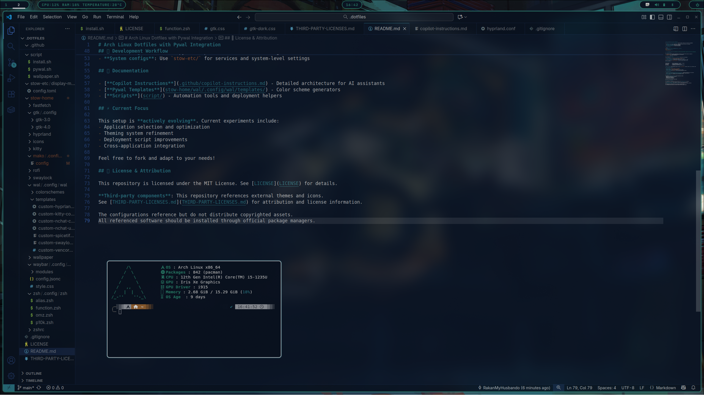
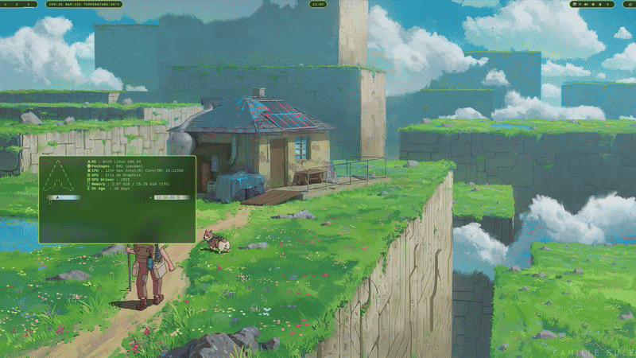

# Arch Linux Dotfiles with Pywal Integration

## 🖼️ Screenshots




*Dynamic pywal theming in action - colors automatically generated from wallpaper and applied across all applications*

> **⚠️ Development Notice**: This repository is actively being developed. Application choices and configurations may change. Always review scripts before execution.

## ⚠️ Security Notice

This repository contains personal configurations. Review all scripts before execution, especially:
- `stow-etc/` - System-level configurations

## 🎨 Dynamic Theming System

The core feature is **automatic color coordination** across your entire desktop:

1. **Set wallpaper**: `~/.dotfiles/script/wallpaper.sh random`
2. **Colors auto-generate**: pywal extracts colors from your wallpaper
3. **Everything updates**: All applications automatically use the new color scheme

Add your wallpapers to `~/Pictures/Wallpaper/` and let the system handle the rest.

## 📁 Architecture

```
├── stow-home/          # User configurations (~/.config/, ~/.local/, ~/)
├── stow-etc/           # System configurations (/etc/)
├── script/             # Automation and deployment scripts
└── .github/            # Documentation and AI assistant instructions
```

**Modular Design**: Each application lives in its own `stow-home/APP/` directory. Want to try a different component? Just create a new stow package and deploy it.

## 🔄 Development Workflow

- **Add new app**: `stow-home/NEWAPP/.config/NEWAPP/`
- **Deploy config**: `stow -t ~ stow-home/NEWAPP`
- **Color integration**: Add pywal template for automatic theming
- **System configs**: Use `stow-etc/` for services and system-level settings

## 📖 Documentation

- [**Copilot Instructions**](.github/copilot-instructions.md) - Detailed architecture for AI assistants
- [**Pywal Templates**](stow-home/wal/.config/wal/templates/) - Color scheme generators
- [**Scripts**](script/) - Automation tools and deployment helpers

## ⚡ Current Focus

This setup is **actively evolving**. Current experiments include:
- Application selection and optimization
- Theming system refinement  
- Deployment script improvements
- Cross-application integration

Feel free to fork and adapt to your needs!

## 📄 License & Attribution

This repository is licensed under the MIT License. See [LICENSE](LICENSE) for details.

**Third-party components**: This repository references external themes and icons.
See [THIRD-PARTY-LICENSES.md](THIRD-PARTY-LICENSES.md) for attribution and license information.

The configurations reference but do not distribute copyrighted assets.
All referenced software should be installed through official package managers.
